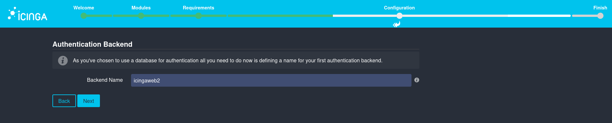

# O11y Practice: Exploring Observability Tools

A hands-on repository focused on learning and experimenting with observability concepts and tools in the context of DevOps.

This repository documents my learning process into observability, providing step-by-step instructions, configurations, and even [VM instances](https://github.com/mcsken/o11y-practice/tree/main?tab=readme-ov-file#vm-instances) for others to explore and play with, out of the box.

## Why Observability?

Observability is a critical aspect of modern DevOps, enabling teams to monitor, debug, and optimize systems effectively. It is often considered the final step in the continuous delivery part of the CI/CD loop as "monitoring", ensuring that deployments are not only successful but also performant, reliable, and scalable in production environments.


To dive into this topic, I selected a set of popular, open-source tools:
 - [Icinga](https://icinga.com/): Monitoring and alerting system.
 - [Prometheus](https://prometheus.io/): Metrics collection and querying tool.
 - [Grafana](https://grafana.com/): Visualization and analytics platform.

## What’s in this Repository?

I started by studying core observability concepts, learning how these tools function by consulting [official documentation, video tutorials, and blogs](https://github.com/mcsken/o11y-practice/tree/main?tab=readme-ov-file#links-to-learning-resources). Then, I set up a VM as the foundation for hands-on experimentation, documenting each step along the way.

Icinga was installed natively on the VM, while the rest of the software was installed via Docker images through [Docker Engine](https://docs.docker.com/engine/).

Additionally, I fixed some bugs (e.g., [Icinga Web 2 Director module deprication](https://github.com/Icinga/icingaweb2-module-director/pull/2946)) and explored the core features of each tool to get a good feel for their use cases.

### Who Is This For?

This repository is ideal for:
 - Beginners looking to understand observability basics and its common tech stack.
 - Engineers unfamiliar with o11y looking for a from-scratch walkthrough.
 - Engineers who want ready-to-use VM instances to skip setup overhead and get to explore and play with the stack themselves.

## Table of contents

1. [Installations & Configurations](https://github.com/mcsken/o11y-practice/tree/main?tab=readme-ov-file#installations--configurations)
   1. [Debian VM Setup (VirtualBox)](https://github.com/mcsken/o11y-practice/tree/main?tab=readme-ov-file#debian-vm-setup-virtualbox)
   2. [Icinga2 Install and set up](https://github.com/mcsken/o11y-practice/tree/main?tab=readme-ov-file#icinga2-install-and-set-up)
   3. [Icinga Web 2 Install and set up](https://github.com/mcsken/o11y-practice/tree/main?tab=readme-ov-file#icinga-web-2-install-and-set-up)
   4. [Director module setup and configuration](https://github.com/mcsken/o11y-practice/tree/main?tab=readme-ov-file#director-module-setup-and-configuration)
   5. [Docker Engine (Debian)](https://github.com/mcsken/o11y-practice/tree/main?tab=readme-ov-file#docker-engine-debian)
   6. [Prometheus with Node Exporter](https://github.com/mcsken/o11y-practice/tree/main?tab=readme-ov-file#prometheus-with-node-exporter)
   7. [Grafana](https://github.com/mcsken/o11y-practice/tree/main?tab=readme-ov-file#grafana)
   8. [check_prometheus icinga plugin](https://github.com/mcsken/o11y-practice/tree/main?tab=readme-ov-file#check_prometheus-icinga-plugin)
2. [Resources](https://github.com/mcsken/o11y-practice/tree/main?tab=readme-ov-file#resources)
   1. [Links to learning resources](https://github.com/mcsken/o11y-practice/tree/main?tab=readme-ov-file#links-to-learning-resources)
   2. [VM instances](https://github.com/mcsken/o11y-practice/tree/main?tab=readme-ov-file#vm-instances)

## Installations & Configurations

### Debian VM Setup (VirtualBox)
Debian Username: `mcdebian`\
Debian password: `mcdebian`\
All settings during the installation process were left at the default value except for the locale settings.

> [!NOTE]  
> Originally, I was having download speed issues with the minimal (net-install) ISO of Debian that were unrelated to my setup, so I used the complete (CD) installation image instead, so to minimize the things necessary to download via the internet during the installation process.
Due to this later I had to remove the CD from the `sources.list` of APT as this caused it to look for updates in the ISO CD and fail APT commands.
> ```bash
> su --login
> nano /etc/apt/sources.list
> Comment out the following by pre-fixing it with a # or by removing it entirely:
> deb cdrom:[Debian GNU/Linux 12.8.0 _Bookworm_ - Official amd64 DVD Binary-1 wi>
> ```
> Following this, I could now install and enable sudo on Debian:
> ```bash
> su –login
> apt-get install sudo
> /sbin/adduser mcdebian sudo
> reboot
> sudo -v
> ```
>`sudo` is not installed and configured by default in Debian due to increased security risks, but since this is a demo project, and it makes working with the terminal much easier I enabled it.
>
> Also, gnome by default doesn't include the minimize and maximize window button, added them with: `gsettings set org.gnome.desktop.wm.preferences button-layout ":minimize,maximize,close"`.
I also configured VirtualBox’s guest additions, but there are plenty of articles about that, here is one: https://linuxize.com/post/how-to-install-virtualbox-guest-additions-on-debian-10/.

### Icinga2 Install and set up
To get a base/demo project setup quickly you can follow the [get started with Icinga documentation]( https://icinga.com/docs/get-started/latest/).

To complete the prerequisites of the quick start section I installed the latest MySQL, following:
https://docs.vultr.com/how-to-install-mysql-on-debian-12
and 
https://www.digitalocean.com/community/tutorials/how-to-install-the-latest-mysql-on-debian-10 .

> [!NOTE]  
> While scrolling through the GitHub repository of Icinga2 I found that newer documentation had been approved but not yet deployed, so I followed [parts of it]( https://github.com/Icinga/icinga2/pull/10136/files#diff-ec6d1e4d67a6159d6a20deb0b605ed229f49686e8bc30f186836e04769336001R34-R40) instead due to it being more optimized (for example skipping installing `gnupg`).

When creating the databases and their respective users I changed the `CHANGEME` identifiers/passwords with the following:\
For `Icingaweb2`: `0PifmAR1K9D8eN9Z0C4P`.\
For `director`: `rmY175yOOnpnhh6UXK9j`.\
For `icingadb`: `7wv0kfW9ZqCU0OF34KiC`.\
As well as set the passwords for MySQL root to: `jkTeIthU9paVtO949VEs`.

### Icinga Web 2 Install and set up
After entering the token generated from the previous steps in the documentation, the setup process begins.

First you get to pick which module to enable and configure, I picked Director, Doc and IcingaDB (on by default).

 
The setup checks if everything is configured correctly so far by this point.
> [!NOTE]  
> In most systems php-imagick is not installed by default and will give a warning, which is fine because this only affects graphs being able to be exported like in PDF exports. I installed it anyway `sudo apt install php-imagick`.


All the database configurations in the web setup need to be configured the same as they were during the database creation. Meaning things like resource name, database name, identifiers/passwords, usernames should match.

For this demo project, host is always `localhost`. All other fields are either matching the database configuration or left default.




Created a demo administrator user.\
Username: `demo_user`\
Password: `6Wknr65NMCuXAS7aFjHv`


  
Overview of Icinga Web configuration:


Following now is the Icinga DB Web configuration.

 
For a baseline/demo project all you need to configure for Redis is the `Redis Host` field as local host. Just make sure the service is running correctly and validate it. 

 
API password: `7192b5df6a60a9c7`


> [!NOTE]  
> I noticed the IcingaDB service was failing to connect at first, after validating the config in all places, I found that in the `/etc/icingadb/config.yml` the password had remained as `CHANGEME` for some reason, after fixing that and rebooting to restart all services, the IcingaDB service was actively running. It still had a warning, but it allowed me to progress, more on that warning later.
> 

After logging in with the `demo_user` you can now see the initial dashboard. The ssh connection fails, I will check that later after configuring the Director module.


> [!NOTE]  
> At this point I took a  break, once I came back Icinga DB had an upgrade. I upgraded it and migrated the DB schema to the new version.
Upgrading Icinga DB:
> ```bash
> cd /usr/share/icingadb/schema/mysql/upgrades/
> ls
> mysqldump -u root -p icingadb > backup_before_1.2.1.sql
> mysql -u root -p icingadb < 1.2.1.sql
> systemctl restart --now icingadb
> systemctl status icingadb
> ```

### Director module setup and configuration
Creating a new database resource for the Icinga Director database:


Same username and password as the Database created earlier: `director`: `rmY175yOOnpnhh6UXK9j`.\
Per documentation character set should be `utf8`.
 


Now you can go to the Icinga Director, select the DB resource the director resource we just created (this was done automatically for me), then you can create schema.


> [!IMPORTANT]  
> At this point I encountered a serious issue that halted my progress. The director DB was error-ing out during the schema creation and failing. [I tried everything within the recommended approaches to fix the issue](https://icinga.com/docs/icinga-director/latest/doc/05-Upgrading/#manual-schema-migrations), but it persisted. So, I manually edited the MySQL schema and got it to work. I then headed to the GitHub repository for the director module to report it as an issue since I couldn't find info for it anywhere else. Before making an issue I made sure I wasn't creating a duplicate, so I searched the open issues and found that [someone had already reported it as a MySQL 8.4+ deprecation issue back in July 6th 2024](https://github.com/Icinga/icingaweb2-module-director/issues/2885). I then made a [pull request for the project](https://github.com/Icinga/icingaweb2-module-director/pull/2946) so that the issue could hopefully be resolved soon and others in the future won’t waste time debugging and manually editing queries like I did.

The "Endpoint Name" is the hostname FQDN, for this local instance it’s the result of `hostname --fqdn`.


Deployed changes from import.


At this point I also properly configured SSH on the VM to get rid of the remaining service warning.


Now everything regarding Icinga2, web, and director, has a completed setup with no issues or warnings.

Here you can download a VirtualBox VM instance at this stage in the setup: https://drive.proton.me/urls/BMZRWFY2BW#YTzbKclPum0q.

After this I created a demo custom service through the director. Order of creation: Host template > host > service template > apply single service. 


### Docker Engine (Debian)
For Icinga I decided to install it directly into the system due to having some configuration complexity, I didn't want to make it more unnecessarily complicated by installing it via docker. Unlike Icinga, Prometheus, Node Exporter and Grafana have pretty straight forward docker installations and I don't expect to have any issues with those, therefore I will be installing those through docker images.

But first I needed to install docker engine for debian through [the official documentation](https://docs.docker.com/engine/install/debian/).

### Prometheus with Node Exporter
I installed node exporter through [the provided docker installation instructions](https://github.com/prometheus/node_exporter?tab=readme-ov-file#docker).\
I also installed Prometheus through the docker image following [the official documentation](https://prometheus.io/docs/prometheus/latest/installation/#using-docker).

I then bind-mounted [the `prometheus.yml` config given for the node exporter](https://prometheus.io/docs/guides/node-exporter/#configuring-your-prometheus-instances) to the prometheus container config file.

> [!NOTE]  
> I had to change the target in the `prometheus.yml` from the default `localhost` in the docs to the Docker Engine default IP of address of `172.17.0.1`. Kept port the same.

```bash
docker run \
    -p 9090:9090 \
    -v /etc/node-exporter-prometheus-config/prometheus.yml:/etc/prometheus/prometheus.yml \
    prom/Prometheus
``` 


> [!NOTE]  
> At this point to make it easier to start the containers after a reboot I renamed them to simply `prometheus` and `exporter`. Although you can use autocomplete, this is easier to remember.
> ```bash
> docker rename <current-name> <new-name>
> ```
> Now to start both I can just do:
> ```bash
> docker start prometheus exporter
> ```

Now the prometheus web interface can be opened at `http://localhost:9090` and you can execute a query on the node exporter metrics. Node exporter metrics mostly start with `node_`. You can also explore the available metrics in the web interface by clicking the three dots to the right of the query execution box. Below is a graph example of the following query `rate(node_cpu_seconds_total{mode="system"}[1m])` which shows 6-threads of the CPU time spent in kernel tasks over the last one minute.


### Grafana

I then installed [Grafana's open-source edition through docker](https://grafana.com/grafana/download?edition=oss&platform=docker) as well.

Once the container is running you can access the web interface through the default address `http://localhost:3000/`. Initially you will be presented with a login page where you can use `admin` for the username and password, once that is done you will be immediately prompted to choose a new password. For details, you can follow the [Grafana set up docs](https://grafana.com/docs/grafana/latest/setup-grafana/).

Grafana username: `admin`\
Grafana password: `6qyHEiX6AMhYd53URKQI`

Now we can add our Prometheus instance as a data source for Grafana.


Set the prometheus server URL to the Docker Engine default IP instead of localhost `http://172.17.0.1:9090`, kept everything else default.


I played around with creating visualizations in Grafana for the Dashboard, I recommend watching the [9th video on their grafana for beginners playlist](https://www.youtube.com/watch?v=yNRnLyVntUw&list=PLDGkOdUX1Ujo27m6qiTPPCpFHVfyKq9jT&index=9).\
I also learned that you can import Dashboard presets made by others. [I found one that was made specifically for a Prometheus & Node Exporter](https://grafana.com/grafana/dashboards/1860-node-exporter-full/), so I tried it out.


### check_prometheus icinga plugin

https://exchange.icinga.com/netways/check_prometheus

```bash
wget https://github.com/NETWAYS/check_prometheus/releases/download/v0.2.0/check_prometheus_v0.2.0_Linux_x86_64
mv check_prometheus_v0.2.0_Linux_x86_64 check_prometheus
mv check_prometheus /usr/lib/nagios/plugins/
nano /etc/icinga2/conf.d/prometheus-commands.conf
nano /etc/icinga2/conf.d/prometheus-service.conf
icinga2 deamon -C  # Checks that the configs are correct.
systemctl reload icinga2
```

Below you can find the `.conf` files and their contents.\
For `prometheus-commands.conf` I based it on [the contributing example from the repo](https://github.com/NETWAYS/check_prometheus/blob/main/contrib/icinga2-commands.conf) and changed `PluginContribDir` to `PluginDir`, but this is just to be consistent, it will still work without this change.
For `prometheus-service.conf` I based it on [the example from the repo again](https://github.com/NETWAYS/check_prometheus/blob/main/contrib/icinga2-service-example.conf), and defined the hostname variable to the Docker Engine address `172.17.0.1` since by default it goes to `localhost`. And added `assign where host.name == NodeName` based on the other plugin `.conf` files in the directory.

[prometheus-commands.conf](assets/prometheus-commands.conf)

[prometheus-service.conf](assets/prometheus-service.conf)


## Resources

### Links to learning resources

[What is Icinga theory](https://icinga.com/docs/icinga-2/latest/doc/01-about/)

[Introductory video by Icinga "Why would you want to use Icinga?"](https://www.youtube.com/watch?v=7rUgcNLodl0)

I recommend only reading what you find interesting here, as there is a lot of information: [Monitoring Basics](https://icinga.com/docs/icinga-2/latest/doc/03-monitoring-basics/)

[Distributed Monitoring Icinga theory](https://icinga.com/docs/icinga-2/latest/doc/06-distributed-monitoring/#distributed-monitoring)

[Grafana technical overview](https://grafana.com/docs/grafana/latest/)

[Grafana prometheus theory](https://grafana.com/docs/grafana/latest/fundamentals/intro-to-prometheus/)

Quite useful start to finish Grafana installation and usage in video format: [Grafana for beginners playlist by Grafana](https://www.youtube.com/watch?v=TQur9GJHIIQ&list=PLDGkOdUX1Ujo27m6qiTPPCpFHVfyKq9jT)

[The software developers side of o11y "Domain-Oriented Observability"](https://martinfowler.com/articles/domain-oriented-observability.html)

[o11y terms/acronyms](https://www.o11y.wiki/#/)

### VM instances

[Download Virtual Box VM export right after successful Icinga and Icinga web installation](https://drive.proton.me/urls/BMZRWFY2BW#YTzbKclPum0q)

[Download Final Virtual Box VM export with full complete setup](https://drive.proton.me/urls/E4D0VP14QC#S0zG914nr63d)
